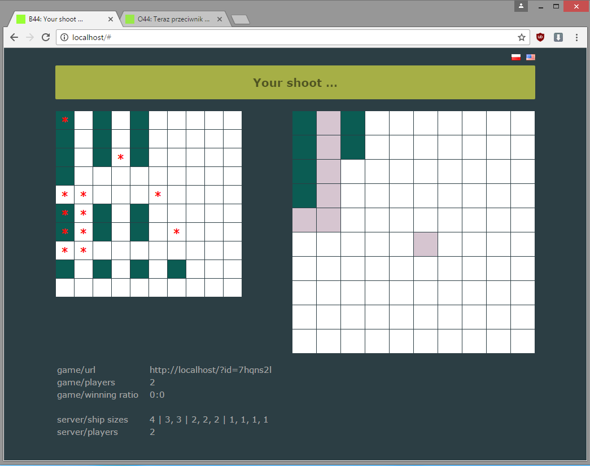

# **Battleship44**

Just <a href="https://en.wikipedia.org/wiki/Battleship_(game)">battleship</a> html5 `game`.  

## features

Supported `fleet sizes`:

* russian (4, 3, 3, 2, 2, 2, 1, 1, 1, 1)
* classic one (5, 4, 3, 3, 2)
* classic two (5, 4, 3, 2, 2, 1, 1)

Supported `fleet modes`:

* straight fleets
* curved fleets

Supported `langs`:  

* english  
* polish  

Supported `browsers`:  

* development mode: last Chrome version, last Firefox version
* production mode: any modern browser

## **architecture**

* back-end (`BE`) and front-end (`FE`) may running separately 
* or `FE` can be copied into `BE` and run together

## **back-end**

* it is `spring boot` application
* `BE` is written in `Java 11`
* `BE` uses `maven` as build automation tool & dependency manager
* required system-wide dependencies: [Java](http://www.oracle.com/technetwork/java/javase/overview/index.html) >= 11, [maven](https://maven.apache.org/) >= 3.3
* install local (project) dependencies: (auto installed while compiling)
* compile `BE` (`FE` not included): `mvn package`
* compile `BE` with included `FE`: `mvn package -Pfe`
* start `BE`: `java -jar -Dserver.port=<port> target/battleship44-0.0.1.jar <game server propertis>`
* available `game server properties`:
  - --game.fleet-type.sizes=russian|classic_one|classic_two
  - --game.fleet-type.mode=straight|curved

## **front-end**

* `FE` is written in `html5+TypeScript2`
* `FE` uses `npm`, `webpack` as build automation tool & dependency manager
* required system-wide dependencies: [nodejs](https://nodejs.org/en/) >=10.0.0
* install local (project) dependencies: `npm install`
* compile `FE` in `development` mode: `npx webpack --mode development`
* compile `FE` in `production` mode: `npx webpack --mode production`
* default backend in `development` mode: `ws://localhost:8080/ws`
* default backend in `production` mode: `protocol + '//' + window.location.host + '/ws`
* compile `FE` with custom backend url: `BACKEND='ws://localhost:8080/ws' npx webpack --mode <mode>`
* start `FE` in the standalone mode: `npm start <server port>`

## changelog 
v1.0 (released 2016-08-18)  
+ first version  
  
v1.1 (released 2016-08-22)  
+ front: general improvements and refactoring  
+ front: handle WinSocket onerror event  
+ front: info about number of players in current game  
+ front: info about current winning ratio  
+ back/front: info about number of players on a server (STAT)  
+ back: add on error controller  
+ back: possible to customize WebSocket conf&policy by .properties file  
  
v1.2 (released 2016-08-31)  
+ front: general improvements and refactoring  
+ front: i18n: strings configurable by json files  
+ front: i18n: polish lang support  
+ front: i18n: possible to change lang without reloading page  
+ front: pointer cursor on all flag, and cross-hair on shoot grid  
  
v1.3 (released 2016-10-05)   
+ front: re-written & refactored js to TypeScript2  
+ front: source now written with targeting es7, es5 also available (transcompiled)  
+ front: minified js file  
+ back: controller fix (commit/b23803f28d790c34e47c8b8d2cf753f07860c15d)  
  
v1.4 (released 2017-05-10)  
+ general: separated front-end/back-end codes, now they can be started separately  
+ front bug fix: WebSocket connection on HTTPS didn't work  
+ front bug fix: URL to flags were incorrect (uppercase)  
  
v1.4.1 (unreleaded)  
+ front: updated dependencies  
+ front: development/build process refactored & simplified  
+ front: refactored code to meet [gts](https://github.com/google/gts) rules  
+ back: updated dependencies  
+ back: code updated to java 11  
  
vX.Y (planned)  
- "availability broadcasting" - look for a waiting player  
- back/front: dynamic info from a server about fleet sizes (was hardcoded in html file)  
- back/front: info which ship sizes has been already shot & which are still to shoot down  
- back/front: a mini chat in game, between players  
- back/front: fleet-type is now game-level, not server-level  
- back/front: grid-size is now game-level, not server-level  
- back/front: able to set custom (game-level) fleet-type (sizes) & grid-size  
  
## protocol
  
→ `TO__ SERVER`  
← `FROM SERVER`  
  
← `HI_. <some_text>`  
  
→ `GAME NEW`  
→ `GAME <game_id>`  
← `GAME OK <game_id>`  
← `GAME FAIL no-such-game`  
← `GAME FAIL no-free-slot`  
← `400_ you-are-in-game`  
  
→ `GRID 0,1,0,1,1,1,0,1,0,1,0,1,1,0,0,0,0`  
← `GRID OK`  
← `GRID FAIL`  
← `400_ no-game-set`  
← `400_ game-in-progress`  
← `400_ grid-already-set`  
  
← `2PLA`  
← `TOUR START`  
← `TOUR YOU`  
← `TOUR HE`  
  
→ `SHOT [0,2]`  
← `YOU_ [SHIP,0,2],[EMPTY,2,1],[EMPTY,2,2]`  
← `HE__ [EMPTY,2,7]`  
← `400_ no-game-set`  
← `400_ game-waiting`  
← `400_ not-your-tour`  
← `400_ bad-shoot`  
  
← `WON_ YOU`  
← `WON_ HE`  
  
← `1PLA game-interrupted`  
← `1PLA game-not-interrupted`  
  
← `STAT players=10,reserved=1`  
  
→ `PING <ping_msg>`  
← `PONG <ping_msg>`  
  
→ `<bad_command>`  
← `400_ unknown-command`  

## documentation
  
* protocol  
* code  
* comments  
